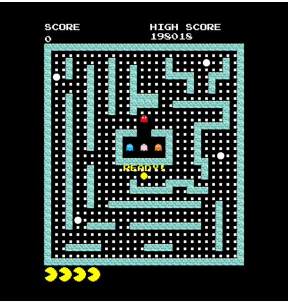

# Welcome to PACMAN game
This is my project for Advanced Programming Course INT2215_21 at VNU - University of Engineering and Technology

## Author
Dang Chau Anh - 23021461
## Programming Languages
- C++

## Supported Software
- IDE: Visual Studio
- SDL2 (for graphical interface)

## Description
This a remake of a famous game - Pacman. I add several features to make the game more interesting!!!

## Installation Guide
1. Install Visual Studio.
2. Download SDL2 and related libraries: SDL_image, SDL_mixer, SDL_ttf
3. Clone this project from GitHub or other repositories.
4. Open the project in VS and build it.
5. Run the application and enjoy the game.

## References
I learn SDL from this website: https://lazyfoo.net/tutorials/SDL/, algorithms and game logic from: https://www.youtube.com/watch?v=OKs_JewEeOo&t=616s, and state-machine concept for the game from the book: SDL Game Development (Packt Publishing) by Shaun Mitchell

Now let's take a closer look at some features: My game has two main mode: PLAY, PLAY EXTRA, GHOST-ADDED MODE

## **PLAY MODE**

- This mode has all the features of the original pacman:

  

- Player can choose the map color:

  

## **PLAY EXTRA MODE**

- Users can the map theme and the maze:

  

  
  
## **GHOST-ADDED MODE**
- Greendy: anti-pacman energizer, make it harder for energized pacman to eat ghosts
  
.png)

# Contributing
Pull requests are welcome. For major changes, please open an issue first to discuss what you would like to change.

# Project status
Project has been completed, but I'm open to any suggestions for improvement.

# Notes
The application is written for educational purposes.
